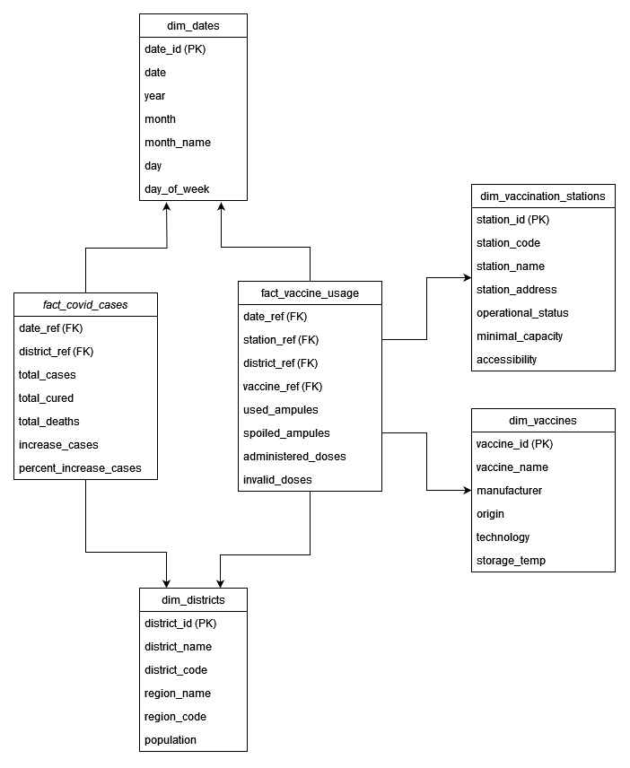
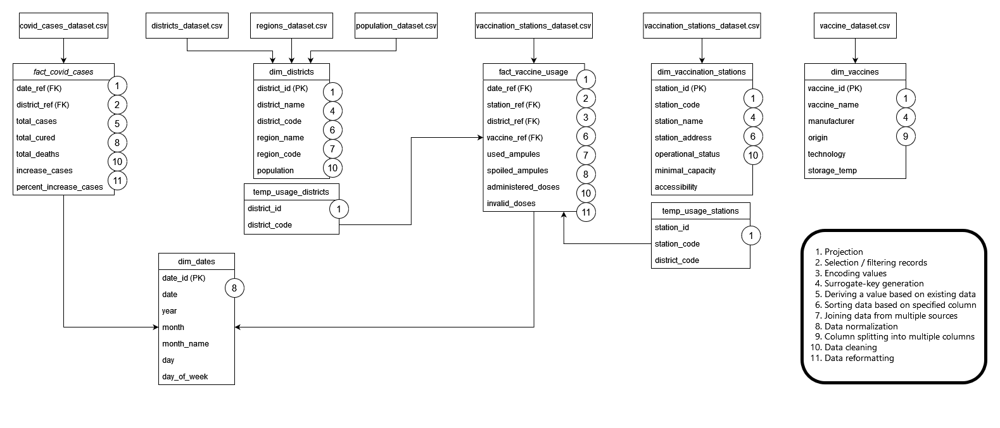

# ASSIGNMENT #1: COVID cases and vaccines administered in the districts of the Czech Republic


## SYSTEM REQUIREMENTS
- Python (version 3.5 or newer)
- PostgreSQL (must be installed and running in order to load datasets)


## INSTALLATION INSTRUCTIONS

1. Create a Python virtual environment in the current directory.
2. Install the "requirements.txt" in the virtual environment.
3. Place a "connection.json" file in the current directory containing the credentials for accessing your PostgreSQL Database, using the template:

```
{
    "dbname": "",
    "user": "",
    "password": "",
    "host": "",
    "port": ""
}
```

4. Run "main.py" to run the entire ETL workflow, or run "main.py" with the command-line argument "extract", "transform", or "load" to perform only that one step of the workflow.


## SCRIPTS

- `main.py`: the script is the entry point of the program. As input it can take a single command-line argument that can be either 'extract', 'transform', or 'load'. If this argument is provided, the script will only perform the one step of the ETL workflow (unless there are necessary files missing). If the argument is not specified, the entire workflow will be performed. This script calls a seperate script for each step of the workflow (detailed below).

- `scripts\extract_datasets.py`: the script extracts all the neccessary datasets, obtained by web download of CSV files, data extraction from Excel worksheets, and web crawling. The `extract_datasets(dataset_dir)` function is called from `main.py` with the path to the directory that the outputs should be saved in. The script outputs the extracted datasets, along with logging information about the state of the extraction. The output datasets are saved as the files:
    - `datasets\covid_cases_dataset.csv`
    - `datasets\districts_dataset.csv`
    - `datasets\population_dataset.csv`
    - `datasets\regions_dataset.csv`
    - `datasets\vaccine_dataset.csv`
    - `datasets\vaccine_usage_dataset.csv`
    - `datasets\vaccination_stations_dataset.csv`

- `scripts\transform_datasets.py`: the script performs all the transformations on the extracted datasets to create the fact and dimension tables defined by the Data Warehouse specification. The `transform_datasets(datasets_dir, tables_dir)` function is called from `main.py` with the path to the directory containing the extracted datasets and the path for a directory that the outputs should be saved in. The script outputs the transformed datasets, along with logging information about the state of the transformations. The output tables are saved in:
    - `tables\dim_dates.csv`
    - `tables\dim_districts.csv`
    - `tables\dim_vaccination_stations.csv`
    - `tables\dim_vaccines.csv`
    - `tables\fact_covid_cases.csv`
    - `tables\fact_vaccine_usage.csv`

- `scripts\load_datasets.py`: the script performs a bulk loading of all the datasets into PostgreSQL. The `load_datasets(tables_dir, config_file)` function is called from `main.py` with the path to the directory containing the transformed datasets, where the config file is the `connection.json` file containing the PostgreSQL connection credentials. The script has no output except for logging information about the state of the load.

- `scripts\transformations.py`: the script contains functions for performing general (i.e. not specific to the dataset) dataframe transformations (projection, selection, add surrogate key...). The functions in this script are accessed by `scripts\transform_datasets.py`.


## DATA WAREHOUSE
The goal of this data warehouse is to prepare datasets about the COVID cases and the usage of vaccines in every district in the Czech Republic in the period between 1.1.2022 and 14.1.2022 (inclusive).


### Data Warehouse Illustration


The data warehouse has a galaxy schema, with two fact tables and four dimension tables:

- `fact_covid_cases`: this table consists of records about the COVID cases per district per day in the defined period. It has a reference to the `dim_dates` table and to the `dim_districts` table. It has 5 measures: `total_cases`, `total_cured`, `total_deaths`, `increase_cases`, and `percent_increase_cases`. The measure `increase_cases` shows the amount of increase in cases in this district from the previous day, and the measure `percent_increase_cases` shows the percent increase in cases in this district from the previous day, rounded to 4 decimal places.

- `fact_vaccine_usage`: this table consists of records about number of administered doses per vaccine type per vaccination station per district per day in the defined period. It has a reference to the `dim_dates`, `dim_districts`, `dim_vaccination_stations` and `dim_vaccines` tables. It has 4 measures: `used_ampules`, `spoiled_ampules`, `administered_doses`, and `invalid_doses`.

- `dim_dates`: this table consists of records about each date between 1.1.2022 and 14.1.2022

- `dim_districts`: this table consists of records about each district in the Czech Republic. The `district_code` is the code of the district according to the LAU1 standard, the `region_code` is the code of the region according to the NUTS3 standard, and the `population` is the population of the district as of 1.1.2022.

- `dim_vaccines`: this table consists of records about COVID vaccines that have been approved for usage. The `origin` is the country/countries the vaccine was developed in, and the `storage_temp` is the storage temperature the vaccine must be stored at to not spoil.

- `dim_vaccination_stations`: this table consists of data about individual COVID vaccination stations across the Czech Republic. The `station_code` is the unique identifier of the station, the `operational_status` is a true/false value denoting whether the station is open, and the `accessibility` if a true/false value denoting whether the station can be accessed by wheelchair users.


## ETL WORKFLOW



### Description of the steps of the workflow
Note: The number in square bracket references the transformation in the legend in the diagram.

- `vaccine_dataset.csv` -> `dim_vaccines`: The vaccine dataset has a column named `vaccine` which contains the full name of the vaccine, including its manufacturer. For the table `dim_vaccines`, we want to have the name of the vaccine in the column `vaccine_name` and the name of the manufacturer in the column `manufacturer`, which is why we must split the column into multiple columns [9] by extracting the vaccine name and the manufacturer name. We add a surrogate key [4] so that the records in the table can be referrenced by the `fact_vaccine_usage` table, and we project the columns [1] so that the original `vaccine` column is left out and the final table consists only of columns `vaccine_id`, `vaccine_name`, `manufacturer`, `origin`, `technology`, and `storage_temp`, in that order.


- `vaccination_stations_dataset.csv` -> `dim_vaccination_stations`, `temp_usage_stations`: We sort the records by the `station_code` column [6] to give an order to the numbers assigned as the keys for the records. We then generate surrogate keys [4] for each record so they can be referenced by the `fact_vaccine_usage` table. We project the columns [1] so that the final table only consists of columns `station_id`, `station_code`, `station_name`, `station_address`, `operational_status`, `minimal_capacity`, and `accessiblity`, in that order. Since the `accessibility` column in the original dataset has 1 if the station is accessible, and None otherwise, we replace the None with 0 to make the field binary [10].
Additionally, from the `dim_vaccination_stations` table, we extract a temporary table that will later be a part of the `fact_vaccine_usage` table. To create this `temp_usage_stations` table, we project [1] the columns `station_id`, `station_code`, and `district_code`. We create this temporary table because we don't necessarily have records from each vaccination station in the `vaccine_usage_dataset.csv`, so if we try to normalize the data by getting all unique vaccination stations and assigning an id to them, we won't get correct referrences, and there are too many stations to manually encode them. Using this temporary dataset we can get the ids of the vaccination station and normalize `fact_vaccine_usage` with them.


- `districts_dataset.csv` + `regions_dataset.csv` + `population_dataset.csv` -> `dim_districts`, `temp_usage_districts`: The `dim_districts` table is formed from joining three datasets. To get the region code of the region of each district, we need to perform a join with the `districts_dataset.csv` and the `regions_dataset.csv` on the `region_name` column [7]. Since 'Hlavni Mesto Praha' is missing from the `districts_dataset` (since Prague is a region, as well as a district), we perform a right join, to keep the 'Hlavni Mesto Praha' record from the `regions_dataset.csv`. We then fill in the null values of `district_name` and `district_code` with the same values as `region_name` and `region_code` (with a 0 at the end, since the district code of every region is "region_code" + "0") [10].
The second join is between the resultant table of the previous join and the `population_dataset.csv` on the `district_name` column [7]. This join is a left join because even if the `population_dataset.csv` is missing some values, we want to keep the record in the database, since the population number is not crucial.
The records are sorted by the `district_code` column to give an order to the numbers assigned as the keys of the records [6]. Then, surrogate keys are generated [4] so the records can be referenced from the `fact_vaccine_usage` and the `fact_covid_cases` tables. By projection [1], we reorder the columns so that the surrogate key is the first value in a record. The final table has the columns `district_id`, `district_name`, `district_code`, `region_name`, `region_code`, and `population`, in that order.
Additionally, from the `dim_districts` table, we extract a temporary table that will later be part of the `fact_vaccine_usage` table. To create this `temp_usage_districts` table, we project [1] the columns `district_id` and `district_code`. We create this temporary table because we don't necessarily have records from each district in the `vaccine_usage_dataset.csv`, so if we try to normalize the data by getting all unique district codes and assigning an id to them, we won't get correct referrences, and there are too many districts to manually encode them. Using this temporary dataset we can get the ids of the districts and normalize `fact_vaccine_usage` with them.


- `vaccine_usage_dataset.csv` + `temp_usage_districts` + `temp_usage_stations` -> `fact_vaccine_usage`: The `fact_vaccine_usage` table is constructed by performing two join transformations [7]. First, we perform an inner join between `temp_usage_districts` and `temp_usage_stations` on the `district_code` column to obtain a table which contains the vaccination stations and the referrences to the districts they are in. Then we perform a second inner join on the resultant table and the `vaccine_usage_dataset.csv` on the `station_code` column to obtain a table where each record has a referrence to the vaccination station and district. We perform inner joins because we only want to keep records that occur in both datasets. We then encode the vaccine manufacturers [3]. There are few of them and manually listing them and using a dictionary to encode them is a viable option. Thus, the `district_ref`, `station_ref`, and `vaccine_ref` columns are normalized [8].
Since the data warehouse only stores data from the period between 1.1.2022 and 14.1.2022, we select only those records that occur in this period [2] and reformat the dates from YYYY-MM-DD format to DD.MM.YYYY, which is a format that is easier for people to read [11]. The records that have no values in the `administered_doses` or `invalid_doses` columns are dropped because these are essential measures for the data warehouse and we are not interested in records which do not have them [10]. The records are sorted by date for ease of search (all the records for a day are next to each other) [6].  We perform a projection [1] so that the final table consists of only columns `date`, `station_ref`, `district_ref`, `vaccine_ref`, `used_ampules`, `spoiled_ampules`, `administered_doses`, and `invalid_doses`, in that order.


- `covid_cases_dataset.csv` -> `fact_covid_cases`: Since the data warehouse consists only of data from the period between 1.1.2022 and 14.1.2022, we select only the records from this period [2], as well as the records from 31.12.2021, which will be needed for computing the values of the column `increase_cases`. The records which have no value for the district are dropped since a referrence to a district is required for each record [10]. The district references are acquired through normalization [8], by sorting the district codes and assigning them a number in order. 
To derive the values of the `increase_cases` column (the increase in cases from the previous day), we use the values in the `total_cases` column of the current record and the record of the same district for the previous day; and to derive the values of the `percent_increase_cases`, we divide the values of the `increase_cases` column and the values of the `total_cases` column [5]. After the columns have been derived, we can drop the records from 31.12.2021. Finally, we reformat the dates from YYYY-MM-DD to DD.MM.YYYY, which is a format that is easier for people to read [11]. We also perform a projection [1] so that the final table consists of only columns `date`, `district_ref`, `total_cases`, `total_cured`, `total_deaths`, `increase_cases`, and `percent_increase_cases`, in that order.


- `fact_vaccine_usage` + `fact_covid_cases` -> `dim_dates`: The `dim_dates` table is constructed from all the dates of the records in `fact_vaccine_usage` and `fact_covid_cases`. The dates in these tables can be replaced by references to records in `dim_dates`, and thus both the fact tables are fully normalized [8].